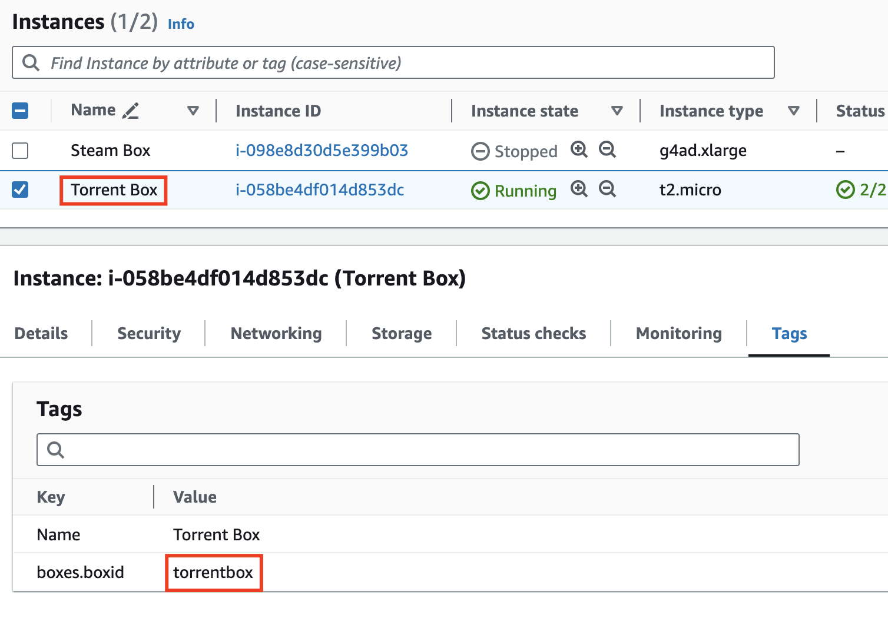

# boxes

[](https://github.com/dwmkerr/boxes/actions/workflows/main.yml) [](https://codecov.io/gh/dwmkerr/boxes)

Quickly turn on, turn off, list and connect to your AWS instances. Great for saving costs by running servers in the cloud and starting them only when needed.

TODO demo recording

## Quickstart

Tag any AWS instance you want to control with a tag named `boxes.boxid`:

TODO smaller screenshot



In this screenshot I have two instances tagged, one with the value `steambox` (used for gaming) and one with `torrentbox` (for fast BitTorrent downloads).

Install the Boxes CLI with:

```bash
npm install @dwmkerr/boxes
```

You can now list your boxes with `list` and start or stop them with `start` and `stop`:


## Developer Guide

Clone the repo, install dependencies, link, then the `boxes` command will be available:

```bash
git clone git@github.com:dwmkerr/boxes.git
npm link

# Now run boxes commands such as:
boxes list

# Clean up when you are done...
npm unlink
```

The CLI uses the current local AWS configuration and will manage any EC2 instances with a tag named `boxes.boxid`. The value of the tag is the identifier used to manage the specific box.

## AWS Configuration

Boxes will use whatever is the currently set local AWS configuration.

Boxes manages EC2 instances that have a tag with the name `boxes.boxid`.

## Terminal Recording / asciinema

The recording at the top of the README file is an SVG based on an [asciinema](https://asciinema.org/) recording that has been converted to SVG with [svg-term-cli](https://github.com/marionebl/svg-term-cli).

To update the recording:

1. Install asciinema `brew install asciinema`

To record a Tmux session, you will need to start _detached_ from Tmux and then attach. You can do this by hand, simply using `tmux attach`, but this adds some noise to the beginning of the recording. A better way is to use the command below:

```bash
asciinema rec --command "tmux attach [-t session-name]"

## TODO

Quick and dirty task-list.

- [ ] npm badge download link
- [ ] screen recording of boxes list / stop / start / connect
- [ ] document how 'connect' works
- [ ] build / lint / test / deploy pipeline
- [ ] add support for OpenVPN server to save $10/month
- [ ] torrent box is not mounting larger volume for storage
- [ ] Cost management tags configuration to allow pricing info
- [ ] docs: make AWS screenshot a bit smaller in readme
- [ ] docs: create and share blogpost
