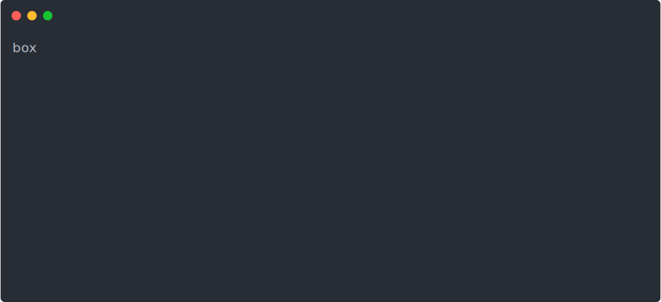

# boxes

[](https://github.com/dwmkerr/boxes/actions/workflows/main.yml)  [](https://codecov.io/gh/dwmkerr/boxes)

Quickly turn on, turn off, list, show costs and connect to your AWS instances. Great for saving costs by running servers in the cloud and starting them only when needed.



## Quickstart

Tag any AWS instance you want to control with a tag named `boxes.boxid`:


In this screenshot I have two instances tagged, one with the value `steambox` (used for gaming) and one with `torrentbox` (for fast BitTorrent downloads).

If you want to be able to report on costs, follow the instructions at [Enabling Cost Reporting](#enabling-cost-reporting).

Install the Boxes CLI with:

```bash
npm install @dwmkerr/boxes
```

The following commands are available for `boxes`:

- [`boxes list`](#boxes-list) - shows all boxes and their status
- [`boxes start`](#boxes-list) - starts a box
- [`boxes stop`](#boxes-list) - stops a box
- [`boxes info`](#boxes-list) - shows info on a box
- [`boxes connect`](#boxes-list) - opens a box
- [`boxes ssh`](#boxes-list) - helps initiate an SSH connection to a box
- [`boxes costs`](#boxes-costs) - shows the costs accrued by each both this month

### `boxes list`

Run `boxes list` to show the details of boxes:

```bash
$ boxes list
steambox: stopped
  Name: Steam Box
torrentbox: running
  Name: Torrent Box
  DNS: ec2-34-221-110-58.us-west-2.compute.amazonaws.com
  IP: 34.221.110.58
```

### `boxes start`

Run `boxes start <id>` to start a box:

```bash
$ boxes start steambox
  steambox (i-098e8d30d5e399b03): stopped -> pending
```

Options:

- `--wait`: wait for instance to complete startup
- `--yes`: [experimental] confirm restoration of archived volumes

Note that the restoration of archived volumes option is experimental and may cause data loss.

### `boxes stop`

Run `boxes start <id>` to stop a box:

```bash
$ boxes stop steambox
  steambox (i-098e8d30d5e399b03): running -> stopping
```

Options:

- `--wait`: wait for instance to complete shutdown
- `--archive-volumes`: [experimental] detach, snapshot and delete instance volumes

Note that the `--archive-volumes` option is experimental and may cause data loss.

### `boxes info`

Run `boxes info <id>` to show detailed info on a box:

```bash
$ boxes info steambox
{
  boxId: 'steambox',
  instanceId: 'i-098e8d30d5e399b03',
  name: 'Steam Box',
  status: 'stopping',
  instance: {
    AmiLaunchIndex: 0,
    ImageId: 'ami-0fae5ac34f36d5963',
    InstanceId: 'i-098e8d30d5e399b03',
    InstanceType: 'g4ad.xlarge',
...
```

### `boxes connect`

The `boxes connect` command can be used to open an interface to a box. For this command to work, you need a `boxes.json` file that specifies _how_ to connect. As an example, the following configuration file shows how to connect to a Torrent Box:

```json
{
  "boxes": {
    "torrentbox": {
      "connectUrl": "http://${username}@${host}:9091/transmission/web/",
      "username": "dwmkerr"
    }
  }
}
```

When you run `boxes connect torrentbox` the `connectUrl` will be expanded with the actual hostname of the running instance, as well as any other parameters in the configuration file (such as the username). Pass the `--open` flag to open the connect URL directly:

```bash
% boxes connect --open torrentbox
{
  url: 'http://dwmkerr@ec2-34-221-110-58.us-west-2.compute.amazonaws.com:9091/transmission/web/',
  username: 'dwmkerr'
}
# the system configured browser will open with the url above...
```

If you want to be able to quickly access a password or credential, put a 'password' field in your config:

```
{
  "boxes": {
    "torrentbox": {
      "connectUrl": "http://${username}@${host}:9091/transmission/web/",
      "username": "dwmkerr",
      "password": "<secret>"
    }
  }
}
```

Now you can add the `--copy-password` or `-p` flag and the password will be copied to the clipboard:

```
% boxes connect --open -p torrentbox
{
  url: 'http://dwmkerr@ec2-34-221-110-58.us-west-2.compute.amazonaws.com:9091/transmission/web/',
  username: 'dwmkerr',
  password: '<secret>'
}

...password copied to clipbord
```

Be careful with this option as it will print the password to the screen and leave it on your clipboard.


### `boxes ssh`

The `boxes ssh` command can be used to quickly ssh into a box. Provide the ssh command that should be used in the `boxes.json` file:

```json
{
  "boxes": {
    "torrentbox": {
      "sshCommand": "ssh -i /Users/dwmkerr/repos/github/dwmkerr/dwmkerr/tf-aws-dwmkerr/dwmkerr_aws_key.pem ec2-user@${host}"
    }
  }
}
```

Running `boxes ssh torrentbox` will expand the command with the host. You can then copy the output and paste into the shell, or run a new shell with this output directly:


```bash
% bash -c "${boxes ssh torrentbox}"
Last login: Thu Nov  9 06:13:09 2023 from 135-180-121-112.fiber.dynamic.sonic.net
...
```

### `boxes costs`

The `boxes costs` command shows the current costs accrued for each both this month. Note that calling the AWS API that gets these costs comes with a charge of $0.01 per call (at time of writing). To continue with the charge, pass the `--yes` parameter to this command.

You must ensure that the `boxes.boxId` tag is set up as a [Cost Allocation Tag](https://docs.aws.amazon.com/awsaccountbilling/latest/aboutv2/cost-alloc-tags.html) for costs to be reported, more information is at [Enabling Cost Reporting](#enabling-cost-reporting).

```bash
% boxes costs --yes
steambox: stopped
  Costs (this month): ~ 0.53 USD
torrentbox: stopped
  Costs (this month): ~ 0.05 USD
Non-box costs
  Costs (this month): ~ 36.92 USD
```

Additional parameters for `costs` are available:

| Parameter               | Description                                       |
|-------------------------|---------------------------------------------------|
| `-m`, `--month <month>` | Get costs for a specific month. 1=Jan, 2=Feb etc. |

### `boxes config`

Shows the current configuration that has been loaded for `boxes`. Can be helpful for troubleshooting whether things like the region are set properly:

```bash
% boxes config
{
  "boxes": ...
  "aws": {
    "region": "us-west-2"
  }
}
```

## Configuration

A local `boxes.json` file can be used for configuration. The following values are supported:

```
{
  "boxes": {
    /* box configuration */
  },
  "aws": {
    "region": "us-west-2"
  }
}
```

Box configuration is evolving rapidly and the documentation will be updated. The AWS configuration is more stable.

## Enabling Cost Reporting

If you want to be able to show the costs that are associated with each box, you will need to:

1. Tag each box and the resources associated with the box with the `boxes.boxid` tag
2. Activate the `boxes.boxid` tag as a cost allocation tag
3. Re-create all of the resources associated with the tag, so that AWS starts collecting cost information
4. Wait 24 hours for AWS to start processing data

## AWS Configuration

Boxes will use whatever is the currently set local AWS configuration.

Boxes manages EC2 instances that have a tag with the name `boxes.boxid`.

## Managing and Reducing Costs

As long as you have followed the [Enable Cost Reporting](#enabling-cost-reporting) guide, then most of the costs associated with a box should be tracked. However, some costs which seem to not be tracked but potentially can be material are:

- EBS instances

### Snapshot Storage

When you turn off EC2 instances, EBS devices will still be attached. Although the instance will no longer accrue charges, you EBS devices will.

To save costs, you can detach EBS devices from stopped instances, snapshot it, delete the device, then re-create the device and re-attach as needed before you restart the instance. However, this is fiddle and time consuming.

Boxes can take care of this for you - when you stop a box, just pass the `-d` or `--detach-and-archive` flag to detach and block storage devices. They will be snapshotted and boxes will restore and re-attach the devices automatically when you restart them.

Boxes puts tags on the instance to track the details of the devices which must be restored - not that if you restart the instance yourself you will have to recreate the devices yourself too, so detaching/archiving is easier if you only use Boxes to manage the device.

## Developer Guide

Clone the repo, install dependencies, build, link, then the `boxes` command will be available:

```bash
git clone git@github.com:dwmkerr/boxes.git
# optionally use the latest node with:
# nvm use --lts
npm install
npm run build
npm link boxes # link the 'boxes' command.

# Now run boxes commands such as:
boxes list

# Clean up when you are done...
npm unlink
```

The CLI uses the current local AWS configuration and will manage any EC2 instances with a tag named `boxes.boxid`. The value of the tag is the identifier used to manage the specific box.

Note that you will need to rebuild the code if you change it, so run `npm run build` before using the `boxes` alias. A quick way to do this is to run:

```bash
npm run relink
```

If you are developing and would like to run the `boxes` command without relinking, just build, link, then run:

```bash
npm run build:watch
```

This will keep the `./build` folder up-to-date and the `boxes` command will use the latest compiled code. This will *sometimes* work but it might miss certain changes, so `relink` is the safer option. `build:watch` works well if you are making small changes to existing files, but not if you are adding new files (it seems).

### Debugging

The [`debug`](https://github.com/debug-js/debug) library is used to make it easy to provide debug level output. Debug logging to the console can be enabled with:

```bash
DEBUG='boxes*' boxes list
```

### Error Handling

To show a warning and terminate the application, throw a `TerminatingWarning` error:

```js
import { TerminatingWarning } from "./errors.js";
throw new TerminatingWarning("Your AWS profile is not set");
```

### Terminal Recording / asciinema

To create a terminal recording for the documentation:

- Install [asciinema](https://asciinema.org/) `brew install asciinema`
- Check that you have your profiles setup as documented in `./scripts/record-demo.sh`
- Run the script to start a 'clean' terminal `./scripts/record-demo.sh`
- Download your recording, e.g. to `./docs/620124.cast`
- Install [svg-term-cli](https://github.com/marionebl/svg-term-cli) `npm install -g svg-term-cli`
- Convert to SVG: `svg-term --in ./docs/620124.cast --out docs/democast.svg --window --no-cursor --from=1000`

The demo script is currently:

- `boxes ls`
- `boxes start steambox`
- `boxes costs --yes`
- `boxes ssh torrentbox`
- `boxes stop steambox`
- `boxes ls`

### Dependencies

Runtime dependencies are:

- `@aws-sdk/client-ec2` - AWS APIs
- `colors` - to add colour to console output
- `commander` - for quickly scaffold CLI apps
- `open` - to open browsers / applications cross-platform

Development dependencies:

- [`aws-sdk-client-mock-jest`](https://github.com/m-radzikowski/aws-sdk-client-mock) mocks for the AWS V3 CLI as well as matchers for Jest

### Troubleshooting

`Argument of type... Types of property '...' are incompatible`

Typically occurs if AWS SDK packages are not at the exact same number as the `@ask-sdk/types` version number. Update the package.json to use exactly the same version between all `@aws-sdk` libraries. Occassionally these libraries are still incompatible, in this case downgrade to a confirmed version that works such as `3.10.0`.

## TODO

Quick and dirty task-list.

### Alpha

- [ ] feat: 'import' option to tag a box and update local config
- [x] bug: stat/stop show 'pending' rather than 'stopped' due to order of logging
- [x] feat: document copy password in connect, maybe better default off
- [x] refactor: suck it up and use TS
- [x] feat: read AWS region from config file, using node-configuration
- [x] npm badge download link
- [x] bug: package.json path
- [x] build / lint / test / deploy pipeline
- [x] screen recording of boxes list / stop / start / connect
- [x] document how 'connect' works
- [x] feat: ssh connect
- [x] docs: make AWS screenshot a bit smaller in readme
- [x] feat: some basic tests
- [x] feat: Cost management tags configuration to allow pricing info TODO check cost allocation report
- [x] build: check coverage working on main
- [x] feat: flag or option to control spend, by enforcing a confirmation for usage of the 'cost' api
- [ ] testing: recreate steam box with cost allocation tag enabled (current cost  0.53 USD)
- [ ] feat: boxes aws-console opens link eg (https://us-west-2.console.aws.amazon.com/ec2/home?region=us-west-2#InstanceDetails:instanceId=i-043a3c1ce6c9ea6ad)
- [ ] bug: EBS devices not tagged -I've tagged two (manually) in jan - check w/ feb bill

### Beta

- [ ] 'wait' flag for start/stop to wait until operation complete - default to 1hr and document the timeout info

### Later

- [ ] refactor: 'wait' functions can be generalised to take a predicate that uses AWS calls and then share the same loop/logging/etc
- [ ] refactor: make 'debug' command local/debug build only?
- [ ] feat: 'import' command to take an instance ID and create local box config for it and tag the instance
- [ ] docs: cost allocation tags blog post
- [ ] docs: create and share blogpost
- [ ] docs: blog post showing step-by-step how to enable cost reporting, add the link to the docs here
- [ ] refactor: extract and test the parameter expansion for 'connect'
- [ ] feat: autocomplete
- [ ] feat: aws profile in config file
- [ ] epic: 'boxes create' to create from a template
- [ ] refactor: find a better way to mock / inject config (rather than importing arbitrarily)

### Epic - Interactive Setup

Run `boxes init` - lets you choose a region, select instances, give a name.
Will add the tags - but will also add the tags to the volumes and will notify if the cost explorer tag is not setup.
Creates the local config.

This would be demo-able.

### Epic - Volume Management

- [x] test '-wait' on start/stop and doc
- [x] propagate tags w/test
- [x] 'start' can now check for 'has archived volumes' and restore if available, this is the next big one
- [x] delete tag on volume restore...
- [x] ...so that we can auto restore volumes when calling 'start' - which will need to wait for the volumes to be ready
- [x] auto-restore on start, this is a good incremental point to check-in, even
      if backup is only via 'debug' and comes later
- [x] rename functions to 'archive' and 'restore' syntax
- [x] data loss warning and generalise the 'yes' flag
- [x] delete snapshot on successful restore
- [x] better logging for non-debug mode (warn user can take time)
- [ ] calling 'detach/etc' fails if instance is not stopped or stopping as it doesn't try to stop the instance - must fail if state is not stopping or stopped
- [ ] new task list - docs, function, parameters, cost saving info, etc
- [x] complete stop/start unit tests
